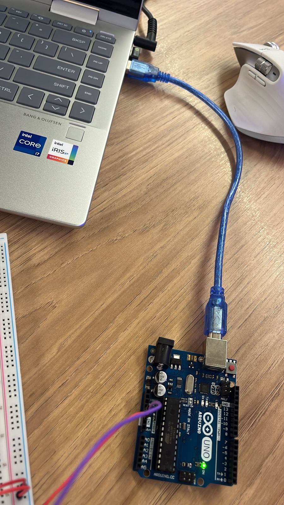
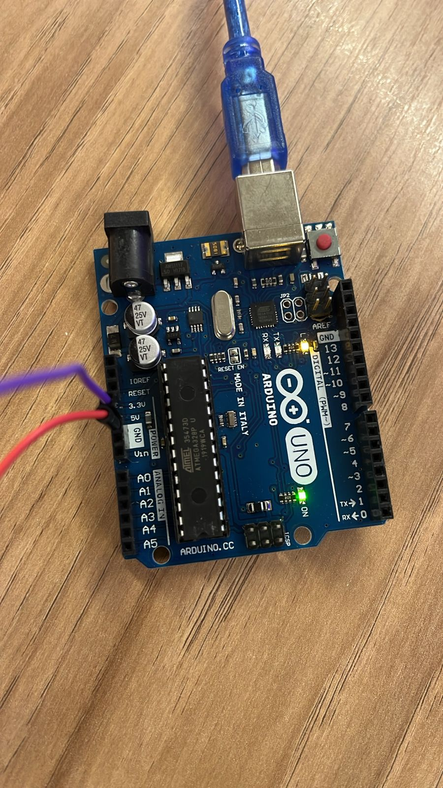

# Projeto Arduino - LED Control

Este repositório contém o projeto desenvolvido para o controle de LED utilizando Arduino.

## 📷 Screenshots

### 1. IDE com Código
Aqui está uma imagem da tela do meu IDE.


### 2. Arduino Ligado ao Computador
Imagem demonstrando o Arduino conectado ao computador.



### 3. LED Aceso
Imagem do LED sendo aceso com sucesso.



## 🎥 Vídeo de Demonstração
Funcionamento completo do Arduino e do LED no vídeo a seguir.

[Link para o Vídeo](assets/video.mp4)

## 🛠️ Código

Código que utilizei para o controle do LED.

```cpp
void setup() {
  pinMode(LED_BUILTIN, OUTPUT);
}

void loop() {
  digitalWrite(LED_BUILTIN, HIGH);  
  delay(1000);                      
  digitalWrite(LED_BUILTIN, LOW);   
  delay(1000);                      
}
```

## 🚀 Como Executar

1. Conecte o Arduino ao computador.
2. Compile e faça o upload do código no IDE Arduino.
3. Verifique se o LED está acendendo e apagando conforme o código.
